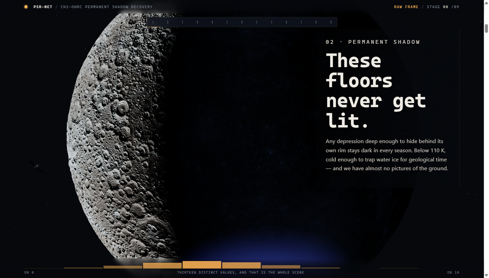
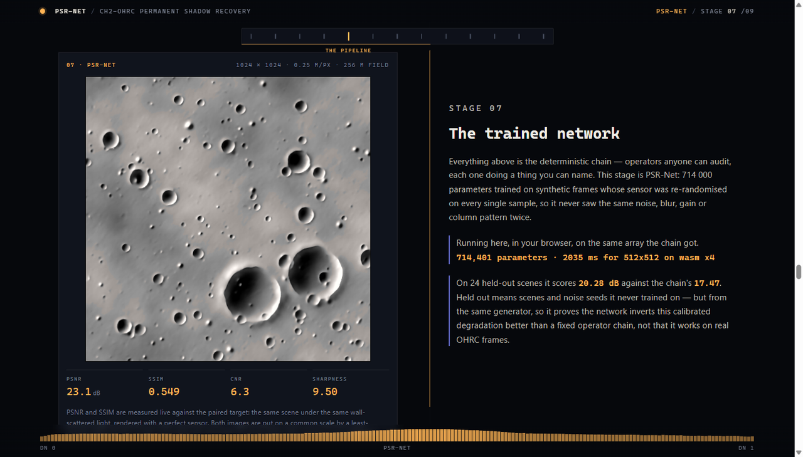

# PSR-NET

**Recovering terrain from permanently shadowed lunar craters imaged by Chandrayaan-2 OHRC.**

[](https://github.com/AtharvaLakhe/SnowWhite/actions/workflows/ci.yml)
[](https://psr-net.vercel.app/psr/)
[](LICENSE)

**→ [psr-net.vercel.app/psr/](https://psr-net.vercel.app/psr/)**



Near the lunar poles the Sun never rises more than a degree or two above the
horizon, so any depression deep enough to hide behind its own rim has been dark
for two billion years. Those floors are cold traps holding water ice, they sit
inside Artemis candidate landing regions, and we have almost no pictures of the
ground. What little light reaches them has scattered off a sunlit wall first —
about a thousandth of what falls on the rim — so an OHRC frame of one is twelve
digital numbers of signal sitting on the noise floor.

This is a single page that explains the problem, runs the recovery in your
browser, and shows its own numbers.

---

## What it does

**A scroll-driven flight.** One continuous scrubbed WebGL path: a full Moon, the
south pole turning toward you, the permanently shadowed regions igniting, the
orbiter arriving, a target locked, the descent, a rover on the floor, and the
frame it takes. Every position is a function of scroll, so it runs backwards
just as well.

**A pipeline you can audit.** Seven deterministic stages — radiometric
correction, column destriping, guided denoise, multi-scale retinex,
Richardson–Lucy deconvolution, clipped CLAHE, blob detection with an ensemble
stability test — each running on the real 12-bit values, in the browser, with
PSNR, SSIM and CNR measured live against a paired target.

**A trained network.** PSR-Net, 714,401 parameters, exported to ONNX and run
with onnxruntime-web on the same array the deterministic chain gets.



---

## Results

Measured on 24 scenes held out of training, with fixed degradation seeds, both
methods given identical input and scored after the same affine fit to the target:

| Method | PSNR (dB) | SSIM |
| --- | --- | --- |
| Raw frame | 17.27 ± 1.45 | 0.257 |
| Deterministic chain | 17.47 ± 1.39 | 0.272 |
| **PSR-Net** | **20.28 ± 2.65** | **0.444** |

Reproduce with `python psr/train/evaluate.py`.

**Read that table honestly.** The +2.81 dB is measured on data from the same
generator the network trained on. It shows the network inverts this calibrated
degradation better than a fixed operator chain — held-out scenes, unseen noise
seeds — but not that it works on real OHRC frames, because it has also learned
the generator's terrain statistics. The deterministic chain stays in the product
precisely because it assumes nothing about what the ground looks like. The
deployment gate is injection-recovery on real frames, not this table.

The chain's own +0.20 dB looks damning until you notice it moves CNR from 2.8 to
4.0. PSNR cannot credit a deliberate non-linear tone change, which is exactly
what retinex and CLAHE are for.

---

## What is measured and what is modelled

A reviewer's first question, answered before it is asked.

| Element | Status | Source |
| --- | --- | --- |
| South-pole topography | **Measured** | LOLA gridded DEM, 16 px/deg, NASA/GSFC CGI Moon Kit |
| PSR extent map | **Derived** | Horizon marching on that DEM from six azimuths at a 1.54° Sun |
| OHRC parameters | **Published** | Mission instrument description: 0.25 m GSD, 64 TDI stages, 12-bit |
| The 256 m crater-floor frame | **Synthetic** | No altimetry resolves 0.25 m. Craters on d⁻²·⁶, boulders on d⁻³ |
| Illumination inside the PSR | **Modelled** | Single-bounce wall scattering, gated by sky visibility |
| Sensor degradation | **Modelled** | Shot noise, dark, read noise, PRNU, column pattern, TDI smear, quantisation |
| Every metric on the page | **Computed live** | In your browser, against the paired target |

There is no ground truth inside a permanently shadowed region — that is the
whole problem. Nobody has photographed the floor of Shackleton in reflected
sunlight, because there has never been any. So the pairs are built the way the
published work builds them ([Bickel et al. 2021][bickel]): model the scene and
the sensor precisely enough to generate exactly-paired examples, then learn the
inverse of a degradation you defined.

[bickel]: https://www.nature.com/articles/s41467-021-25882-z

---

## Run it

Needs [Node.js](https://nodejs.org) 18+ and a current browser. No Python, no
build step, no accounts.

```bash
git clone https://github.com/AtharvaLakhe/SnowWhite.git
cd SnowWhite
npm install
npm run serve
```

- **http://localhost:8123/psr/** — PSR-NET
- **http://localhost:8123/** — the orbital lunar terminal

It must be served over HTTP; the ES module import map will not resolve over
`file://`. `PORT=3000 npm run serve` if 8123 is taken.

`npm install` is the only step that touches the network. After it, everything
runs offline — every texture, model and script is served from this repository.

```bash
npm test           # coordinate maths and query parsing
npm run test:e2e   # drives a real headless browser; needs the server running
```

---

## Training the model

```bash
pip install torch --index-url https://download.pytorch.org/whl/cu128
pip install numpy scipy pillow scikit-image onnx onnxruntime

python psr/train/synth.py 384     # cache the scene bank (~7 min, 386 MB)
python psr/train/train.py         # 36k steps, ~2 h on an RTX 5050
python psr/train/evaluate.py      # learned vs the deterministic chain
python psr/train/export_onnx.py   # ONNX + numeric check, into psr/model
```

Scenes are cached once; the **sensor is re-randomised on every sample**, with
every parameter drawn from a range wider than OHRC's nominal figures — PSF
0.55–1.9 px, read noise 16–44 e⁻, secondary illumination log-uniform across
10⁻⁴–6×10⁻³. A model that only works at nominal values has learned the
simulator, not the inverse problem.

`export_onnx.py` refuses to write a model whose ONNX graph disagrees with the
PyTorch one by more than 2×10⁻³, because an ONNX file that loads is not an ONNX
file that agrees.

The 386 MB scene bank is not committed; it rebuilds in minutes. The trained
checkpoint and the exported ONNX are, so you can present or verify without
training anything.

---

## Layout

| Path | Role |
| --- | --- |
| `psr/index.html` | The page: flight, pipeline, model, validation, provenance, lab |
| `psr/journey.js` | The scroll-scrubbed WebGL flight, Moon to rover |
| `psr/engine.js` | The enhancement operators and metrics, all of them |
| `psr/net.js` | ONNX inference in the browser, with a graceful absent-weights path |
| `psr/psr.js` | Scene orchestration, pipeline caching, the lab |
| `psr/render_scene.py` | Generates the page's scenes from the LOLA DEM |
| `psr/train/` | Scene synthesis, model, training, evaluation, export |
| `psr/model/` | The shipped weights, their metadata and their benchmark |
| `scripts/vendor.mjs` | Copies three, gsap and onnxruntime out of node_modules |
| `assets/` | The Moon: displaced mesh, LROC colour, LOLA-derived normals |
| `main.js`, `geo.js`, `places.js` | The orbital terminal at `/` |

---

## Deploying

Vercel watches this repository: pushing to `main` deploys to production, and any
other branch gets a preview URL.

The build runs `scripts/vendor.mjs`, which copies three, gsap and the ONNX
runtime out of `node_modules` into `vendor/`. The import maps point at
`/vendor`, so the same paths work locally and on a static host, where
`node_modules` does not exist. The site also sets `Cross-Origin-Opener-Policy`
and `Cross-Origin-Embedder-Policy`, without which onnxruntime-web cannot use
threads.

---

## Credits

Lunar topography and imagery: **NASA/GSFC Scientific Visualization Studio**,
[CGI Moon Kit][kit] — LOLA gridded DEM and the LROC WAC global mosaic. NASA data
is not subject to copyright protection in the United States.

Built for the *Enhancement of Permanently Shadowed Regions of Lunar Craters
Captured by OHRC* problem statement. MIT licensed — see [LICENSE](LICENSE).

[kit]: https://svs.gsfc.nasa.gov/4720
